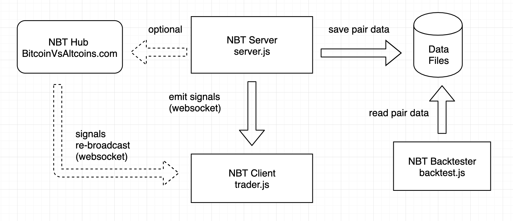

<h1 align="center">Node Binance Trader NBT</h1>

<h6 align="center">Version 0.2.4</h6>

[](https://wallet.nimiq.com/nimiq:NQ38SDPGREC3USTALLCT87GQTCUYFH5L6PCQ)



<h4 align="center">NBT is an open cryptocurrency trading bot development framework for the Binance exchange.</h4>

NBT includes 3 main JS scripts:

* the **server**:

  * to track a selection of asset pairs and record all binance api data (candles, depths, trades) into a Postgres database.
  * to detect buy or sell signals
  * (optional) to send trading signals to the NBT Hub / [Bitcoin vs. Altcoins](https://bitcoinvsaltcoins.com) to monitor performances and auto trade those signals (virtually or for real).

* the **trader**: [](https://heroku.com/deploy?template=https://github.com/jsappme/nbt-binance-auto-trader)

  * this script allows you to auto trade the signals received from the NBT hub or your own server. this script can run locally or on cloud services like Heroku. This new auto trader script allows you to trade with leverage when the pair is available for margin trading.

* the **backtest** :

  * to backtest your strategies on the historical tick data (Postgres database) recorded by the server.

# Requirements

* [Git](https://git-scm.com/download/) (see if it is already installed with the command: *git --version*)
* [Node.JS](http://nodejs.org) (see if it is already installed with the command: *npm --version*)

# Installation 📦

```
git clone https://github.com/jsappme/node-binance-trader
cd node-binance-trader
npm i --unsafe-perm
```

# Usage ⚡️

Before everything please review the source code of the JS scripts (server.js, trader.js) and add your key information (BvA, Binance, etc...)

**To start the server** to save pair data, define strategies and emit trading signals:
```
npm run start
```

**To start the auto trader** to monitor strategies and signals received from the server or the NBT Hub:

<i>Important note: Always make sure to have some BNB available on your corresponding wallet to pay for the fees.</i>

```
npm run trader
```

**To backtest** strategies using the data recorded by the server:
```
npm run bt
```

# Web Socket API specifications 📡

Feel free to connect your Node.js scripts to the NBT hub Websocket server to monitor the performance of your signals and strategies on [BvA](https://bitcoinvsaltcoins.com)

***From your NBT Server, you can:***

**Send a Buy Signal** to the NBT hub:
```
const buy_signal = {
    key: bva_key,
    stratname: stratname,
    pair: pair, 
    buy_price: first_ask_price[pair], //optional
    message: Date.now(), //optional
    stop_profit: Number(stop_profit[pair+signal_key]), //optional
    stop_loss: Number(stop_loss[pair+signal_key]), //optional
}
socket_client.emit("buy_signal", buy_signal)
```

**Send a Sell Signal** to the NBT hub:
```
const sell_signal = {
    key: bva_key,
    stratname: stratname, 
    pair: pair, 
    sell_price: first_bid_price[pair] //optional
}
socket_client.emit("sell_signal", sell_signal)
```

You can also communicate via the NBT hub to your auto trader to track your traded signals.

***From your NBT Trader, you can:***

**Receive a Buy Signal** from the NBT hub, to trade a signal from a strategy selected on BvA.
```
socket.on('buy_signal', async (signal) => {
    console.log(signal.userid)
    console.log(signal.nickname)
    console.log(signal.stratid)
    console.log(signal.stratname)
    console.log(signal.pair)
    console.log(signal.price) // buy price
    console.log(signal.new)  //new signal or closing an existing signal
})
```

**Receive a Sell Signal** from the NBT hub, to trade a signal from a strategy selected on BvA.
```
socket.on('sell_signal', async (signal) => {
    console.log(signal.userid)
    console.log(signal.nickname)
    console.log(signal.stratid)
    console.log(signal.stratname)
    console.log(signal.pair)
    console.log(signal.price) // buy price
    console.log(signal.new)  //new signal or closing an existing signal
})
```

**Send a Traded Buy Signal** to the NBT hub:
```
const traded_buy_signal = {
    key: bva_key,
    stratname: signal.stratname,
    stratid: signal.stratid,
    trading_type: user_payload[tresult].trading_type,
    pair: signal.pair, 
    qty: Number(user_payload[tresult].buy_amount)
}
socket.emit("traded_buy_signal", traded_buy_signal)
```

**Send a Traded Sell Signal** to the NBT hub:
```
const traded_sell_signal = {
    key: bva_key,
    stratname: signal.stratname,
    stratid: signal.stratid,
    trading_type: user_payload[tresult].trading_type,
    pair: signal.pair, 
    qty: Number(user_payload[tresult].buy_amount),
}
socket.emit("traded_sell_signal", traded_sell_signal)
```


# Disclaimer 📖

```
I am not responsible for anything done with this bot.
You use it at your own risk.
There are no warranties or guarantees expressed or implied.
You assume all responsibility and liability.
```

# Final Notes 🙏

Feel free to fork and add new pull request to this repo.
If you have any questions/suggestions, or simply you need some help building your trading bot, or mining historical data or improving your strategies using the latest AI/ML algorithms, please feel free to <a href="mailto:herve76@gmail.com" target="_blank">contact me</a>.

If this repo helped you in any way, you can always leave me a BNB tip at 0xf0c499c0accddd52d2f96d8afb6778be0659ee0c

# GETTING IN TOUCH 💬

* **Discord**: [Invite Link](https://discord.gg/4EQrEgj)

<p align="center">
  <a href="https://discord.gg/4EQrEgj"></a>
</p>
