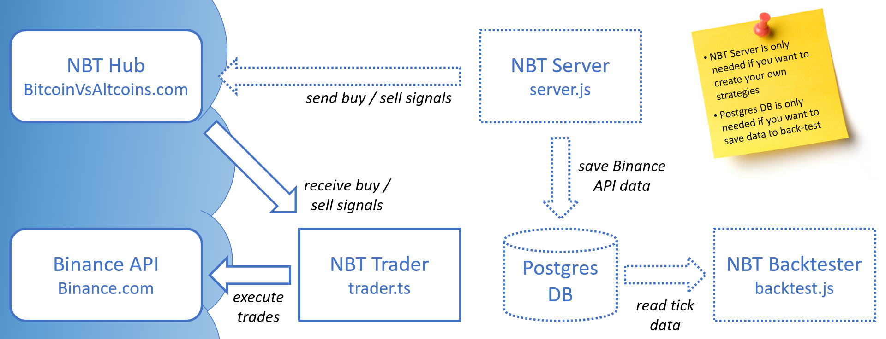

<h1 align="center">Node Binance Trader NBT</h1>

<h4 align="center">NBT is a Cryptocurrency Trading Strategy & Portfolio Management Development Framework for <a href='https://www.binance.com/en/register?ref=DULNH2ZZ' target="_new">Binance</a>.</h4>

## Table of contents

1. **[Documentation 📖](#documentation-📖)**
1. **[Technical overview 👨‍💻](#technical-overview-👨‍💻)**
1. **[Disclaimer 📖](#disclaimer-📖)**
1. **[Donate 🙏](#donate-🙏)**
1. **[Getting in touch 💬](#getting-in-touch-💬)**
1. **[Final Notes](#final-notes)**

## Documentation 📖

- **[Quick start guide 🚀](./docs/GETTING-STARTED.md)**: bootstrap using Heroku
- **[Manual setup guide 👨‍💻](./docs/GETTING-STARTED-MANUALLY.md)**: bootstrap using your own client
- **[Web socket API specification 📡](./docs/WEB-SOCKET-API-SPECIFICATION.md)**

## Technical overview 👨‍💻

NBT includes 3 main JS scripts:

* the **server**:

  * to track a selection of asset pairs and record all [Binance](https://www.binance.com/en/register?ref=DULNH2ZZ) api data (candles, depths, trades) into a Postgres database.
  * to detect buy or sell signals
  * (optional) to send trading signals to the NBT Hub / [Bitcoin vs. Altcoins](https://bitcoinvsaltcoins.com) to monitor performances and auto trade those signals (virtually or for real).

* the **trader**: 

  * this script allows you to auto trade the signals received from the NBT hub or your own server. this script can run locally or on cloud services like Heroku. This new auto trader script allows you to trade with leverage when the pair is available for margin trading.

* the **backtest** :

  * to backtest your strategies on the historical tick data (Postgres database) recorded by the server.

## Disclaimer 📖

> No owner or contributor is responsible for anything done with this bot.
> You use it at your own risk.
> There are no warranties or guarantees expressed or implied.
> You assume all responsibility and liability.

## Donate 🙏

Become a patron, by simply clicking on this button (**very appreciated!**):

If this repo helped you in any way, you can always leave me a BNB tip at 0xf0c499c0accddd52d2f96d8afb6778be0659ee0c

## Getting in touch 💬

* **Discord**: [Invite Link](https://discord.gg/4EQrEgj)

  

## Final Notes

Feel free to fork and add new pull request to this repo.
If you have any questions/suggestions, or simply you need some help building your trading bot, or mining historical data or improving your strategies using the latest AI/ML algorithms, please feel free to <a href="mailto:herve76@gmail.com" target="_blank">contact me</a>.
