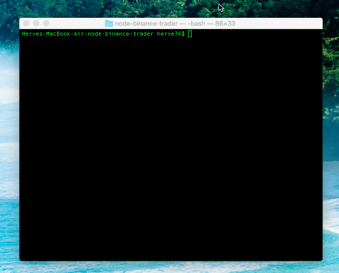

<h1 align="center">
  <br>
  
</h1>

<h4 align="center">Node-Binance-Trader</h4>

<p align="center">
  
  
  
  <a href="https://discord.gg/4EQrEgj"></a>
</p>

<h4 align="center">An efficient cryptocurrency trading bot for Binance using Node.js 💸</h4>

# Why Node-Binance-Trader? 🤔

My name is Herve Fulchiron, I’m a passionate full stack JS engineer, and I also trade cryptocurrencies on a weekly basis. I mostly use <a href="https://www.binance.com/?ref=10177791" target="_blank">Binance</a> for my altcoins trading. The high volatility of the crypto market makes it an emotional rollercoster that requires high awareness and constant attention. This demands a lot of time to monitor always more trading pairs and more data to process. Like most of the people I used to trade manually via the Binance website. I was slow to execute and beating the market gets more difficult every days.  It was time to upgrade my trading operation.

# What is Node-Binance-Trader? 📡

Today NBT is an experimental node.js trading bot that will:

* ask for a trading pair
* ask for a loss pourcentage
* ask for a profit pourcentage
* and dynamically auto trade the whole operation.

# Installation 📦

```
git clone https://github.com/jsappme/node-binance-trader
cd node-binance-trader
npm i
npm i -g
```

# Configuration 🔑

1. Signup Binance ( Referral url: https://www.binance.com/?ref=10177791 )
2. Enable Two-factor Authentication    
3. Go API Center, https://www.binance.com/userCenter/createApi.html
4. Create New Key
        [✓] Read Info [✓] Enable Trading [X] Enable Withdrawals
5. Copy the API key and secret to index.js

# Usage ⚡️

```
node index.js
```
or

```
nbt
```

# Customization 🛠️

Coming up...


# Roadmap 🚧

* ✔️ Dynamic trading
* Add strategies + auto trades
* Add an AI/ML "brain" to the bot


# Disclaimer 📖

```
I am not responsible for anything done with this bot.
You use it at your own risk.
There are no warranties or guarantees expressed or implied.
You assume all responsibility and liability.
```

# Final Notes 🙏

Feel free to fork and add new pull request to this repo.
If you have any questions/suggestions, or simply you need some help building your trading bot, or mining historical data or improving your strategies using the latest AI/ML algorithms, please feel free to <a href="mailto:herve76@gmail.com" target="_blank">contact me</a>.

If this repo helped you in any way, you can always leave me a BNB tip at 0xf0c499c0accddd52d2f96d8afb6778be0659ee0c

# GETTING IN TOUCH #

* Discord: [Invite Link](https://discord.gg/4EQrEgj)
