[Bitcoin vs. Altcoins](https://bitcoinvsaltcoins.com)

# Getting started

This step by step guide will help you get your account up and running with the popular BVA strategy.

The total time to complete this guide should be less than 10 minutes if you already have a Binance account registered with funds. If not, it will take a little longer just to get yourself set up on Binance and transfer your funds in.

## Table of contents

1. **[How to get started](#how-to-get-started)**
1. **[Setting up your own personal trading bot](#setting-up-your-own-personal-trading-bot)**
1. **[Getting it running](#getting-it-running)**
1. **[Start trading](#start-trading)**
1. **[Keep it trading 24/7](#keep-it-trading-24/7)**
1. **[Common questions](#common-questions)**

## How to get started

First, you need an account with Binance. The registration can be done here: https://accounts.binance.com/en/register

By default the trader tries to trade with margin, so you need to have at least 0.001 BTC in your spot as well as your margin account.
Also, to cover trading fees, you'll need a small amount of BNB in both your spot and margin wallets.

If you use Margin Trading on Binance, please make sure to enable "Using BNB For Interest" like this:

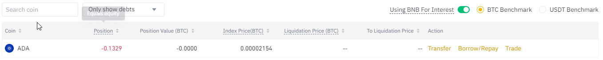

If you need more information on how to set up Binance and the different wallets you can find lots of additional information here: https://www.binance.com/en/support/

You will also need to create an account on [Bitcoin vs. Altcoins](https://bitcoinvsaltcoins.com), which you can do by clicking the login button and choosing the sign up option.

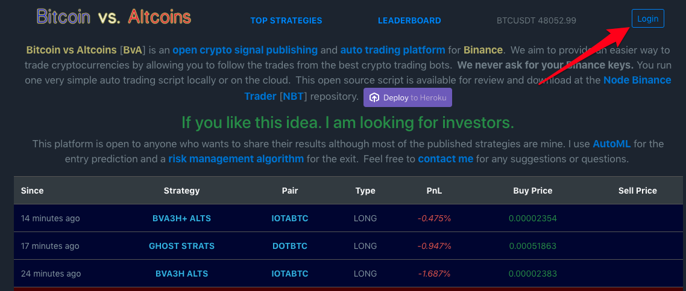

Finally you will need a free [Heroku](https://heroku.com/) account set up, which you can register here: https://signup.heroku.com/
Once you have these accounts set up, you're ready to set up the actual trading!

## Setting up your own personal trading bot

While the Bitcoin vs. Altcoins website itself is closed source, the  automated trading bot called [Node Binance Trader (NBT)](https://github.com/jsappme/node-binance-trader) is open source. It connects to your Binance account via the Binance API and executes the trades on your behalf.

NBT needs to be hosted by yourself, which makes the deployment independent and secure. Luckily this is easy to set up and can be done with one click!

Clicking this button will take you to this screen:

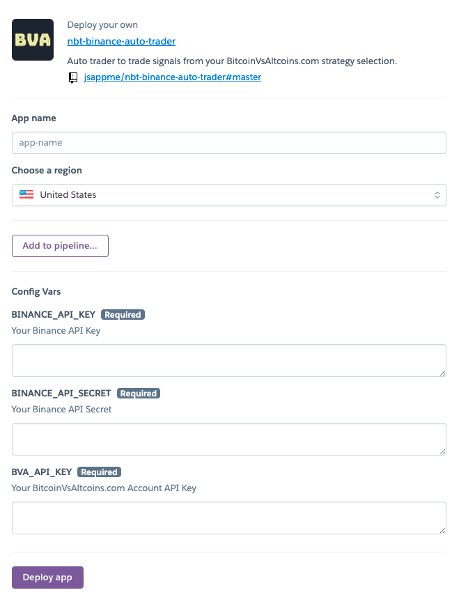

Choose any unique name you like and enter a region. You will then need to retrieve your Binance API keys from Binance. They will need to allow trading and margin wallet access. Follow this guide for more information on how to do so: https://www.binance.com/en/support/faq/360002502072-How-to-create-API

You will find your Bitcoin vs. Altcoins support key in your account here: https://bitcoinvsaltcoins.com/profile

Once you have filled in these details you can hit *Deploy app* and the app will be created for you.

## Getting it running

Now that you have all the infrastructure set up, you need to decide what strategy you want to follow. In this guide, we are setting up your account for the BVA strategy but you can choose whichever you want. This page is a good place to start: https://bitcoinvsaltcoins.com/topstrats

Use the *Fav.* toggle to select strategies that you like. It's usually wise to judge the performance of any strategy against the value of just holding bitcoin.

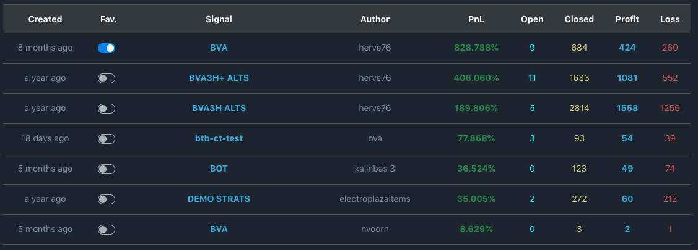

The BVA stategy's philosophy is to accumulate BTC, so there will only be trades against BTC.

Another key metric to look for is how many positions have closed in profit vs. those that have closed in loss.

Once you have selected your strategies you will see that they are now present in your profile:

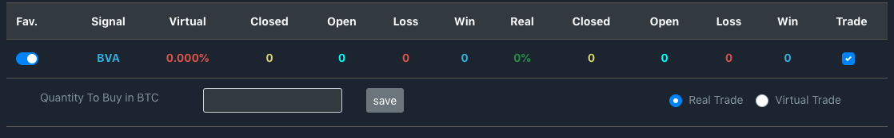

Here you can choose if you want to trade for real or paper trade (with virtual money), as well as the amount from your Binance account which you want to trade with. Please note, this is the amount the bot will use per trade and there can be multiple open trades at once. A sensible approach may be start with this value set at 10% of the value you want to trade with. You'll also need to check the *trade* box to make the signal live.

You're almost done.

## Start trading

Log into your Heroku account and open your deployed app:

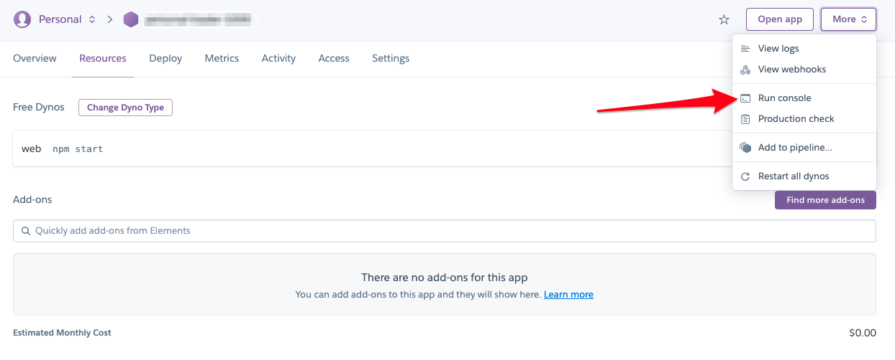

To make sure it is running, go to Resources tab and check if the dyno is switched to on.

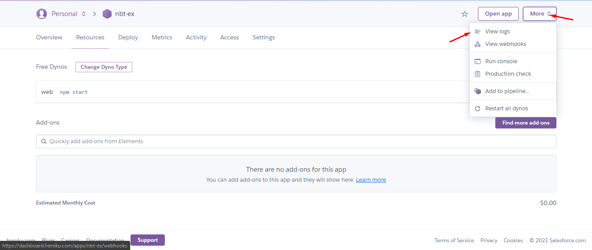

Let's check if the bot is running from the logs. You also can check detailed information about the bot from those logs.

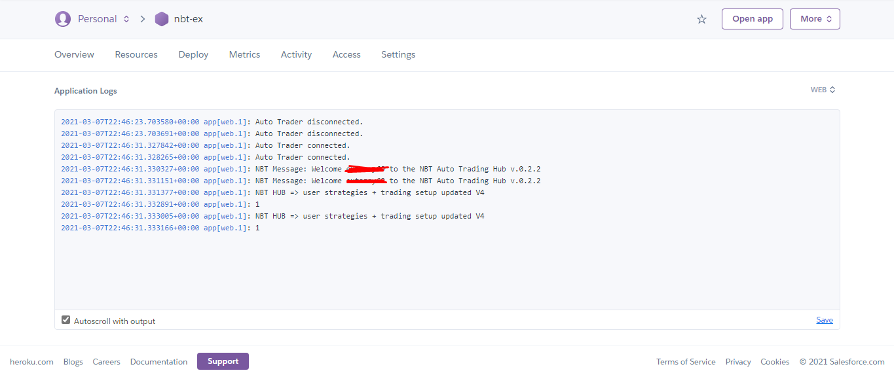

This is an example of how it looks if the bot is running. Make sure to switch from All process to Web.

## Keep it trading 24/7

Now you are officially up and running! However there is one last task to do. As you are on the free plan, Heroku will close your app if it's not used every 20 minutes. This means your bot will stop trading. You can either upgrade to a paid plan, which prevents this from happening, or you can remain on the free tier with two simple steps.

### Step 1

Heroku only gives dyno's on its free tier 550 hours of run time per month. This is just short of what you will need to keep your new trading bot up and running 24/7. But by simply adding your credit card to your Heroku account your allowance is extended to 1000 hours, which is plenty. Now all you need to do is stop your dyno from falling asleep. This can be easily achieved by regularly pinging its URL.

### Step 2

Go to https://uptimerobot.com/ and register for a free account. Once you have done this you will need to set up a new monitor. To do this use the *+ Add New Monitor* button and choose HTTP(s) from the drop down:

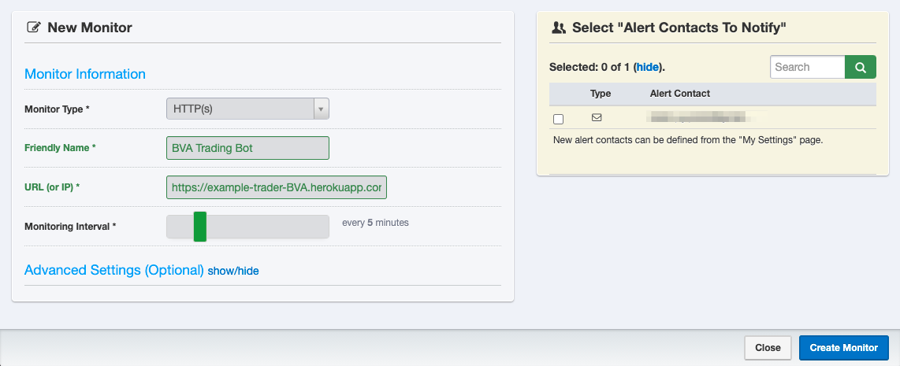

You can find the URL within your Heroku settings:

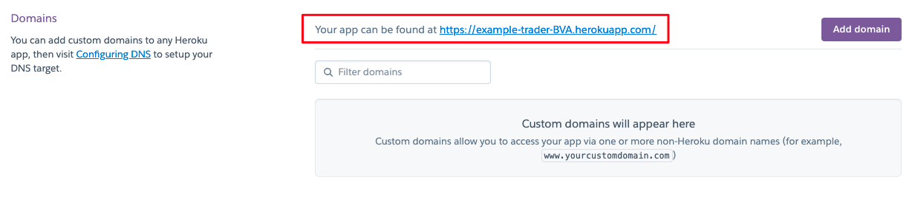

Once you have created this monitor, you're done! Now you have a live trading bot running your chosen strategy.

## Common Questions

### How do I know it's running?

You can check into your account to see your progress and see something like this:

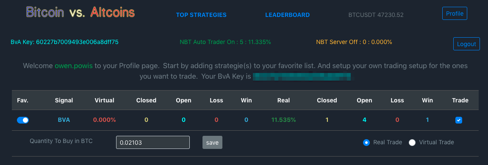

"NBT Auto Trader" is the trading bot and this should be on and green. The NBT Server is not needed unless you want to create your own custom strategies and publish them to the BVA page.

If you are seeing "NBT Auto Trader Off" then go back to Heroku to check if the bot is running via log console. If it's on idle or crashed state, you need to restart your dyno.

### Is it secure?

You host the trading bot yourself, which is in itself open source. Meaning anyone can inspect the code. Your Binance API keys are retained on your own instance in Heroku, rather than being shared directly with BVA.

Additionally the default permissions which you use within Binance are set to only allow anything using that API to trade between currencies. Currency cannot be withdrawn from your account.

If you have any concerns about your existing account, you can always use a separate Binance account specifically for using this bot.
